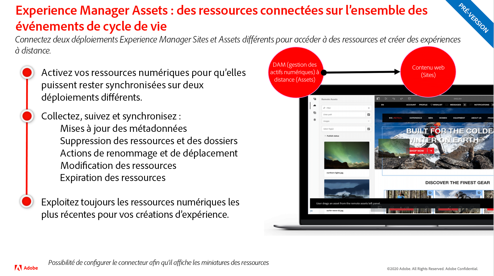

# Mises à jour des versions d’Adobe Experience Manager as a Cloud Service

Découvrez rapidement les dernières fonctionnalités d’Adobe Experience Manager as a Cloud Service. Il s’agit de vidéos courtes, d’environ 10 minutes, diffusées par l’équipe produit d’AEM qui partagent les points forts de la dernière version.

## Dernière mise à jour

<table style="max-width: 50%;">
<tr>
  <td>
    
    

      <a href="./2022/2022-3-0.md">
        <strong>Version | 2022.3.0</strong>
         
      </a>
        <em>Publié le 31 mars 2022 </em>
    

    

      <a href="https://experienceleague.adobe.com/docs/experience-manager-cloud-service/content/release-notes/release-notes/release-notes-current.html">Notes de mise à jour</a>
    

  </td>
</tr>  
</table>

## Mises à jour précédentes

<table style="max-width: 50%;">
<tr>
  <td>
    
    

      <a href="./2022/2022-1-0.md">
        <strong>Version | 2022.1.0</strong>
         
      </a>
        <em>Publié le 3 février 2022 </em>
    

    

      <a href="https://experienceleague.adobe.com/docs/experience-manager-cloud-service/content/release-notes/release-notes/2022/release-notes-2022-1-0.html">Notes de mise à jour</a>
    

  </td>
  <td>
    
    

    <a href="./2021/2021-11-0.md">
        <strong>Version | 2021.11.0</strong>
         
      </a>
    <em>Publié le 16 décembre 2021</em>
    

    

      <a href="https://experienceleague.adobe.com/docs/experience-manager-cloud-service/content/release-notes/release-notes/2021/release-notes-2021-11-0.html">Notes de mise à jour</a>
    

  </td>
</tr>
</table>
