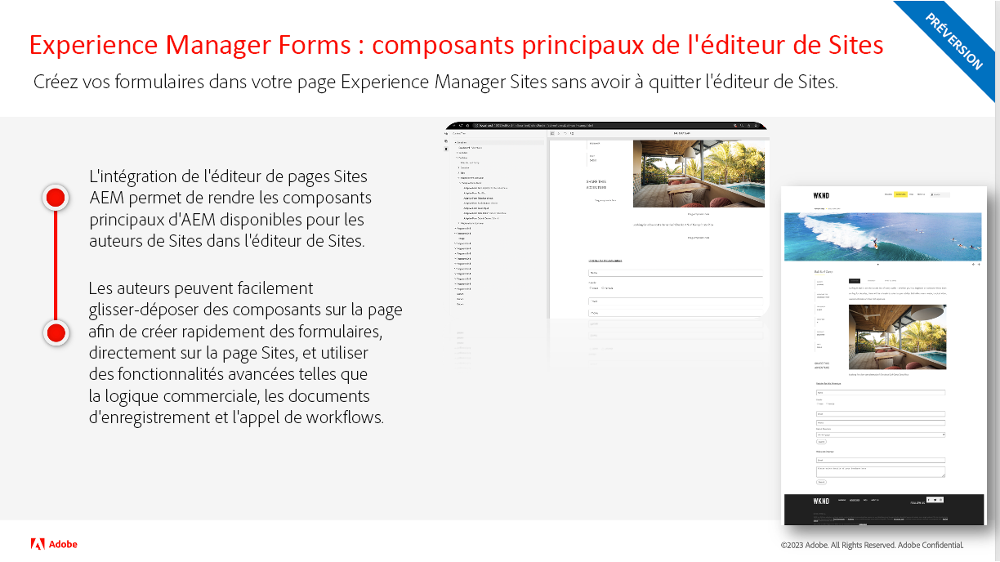
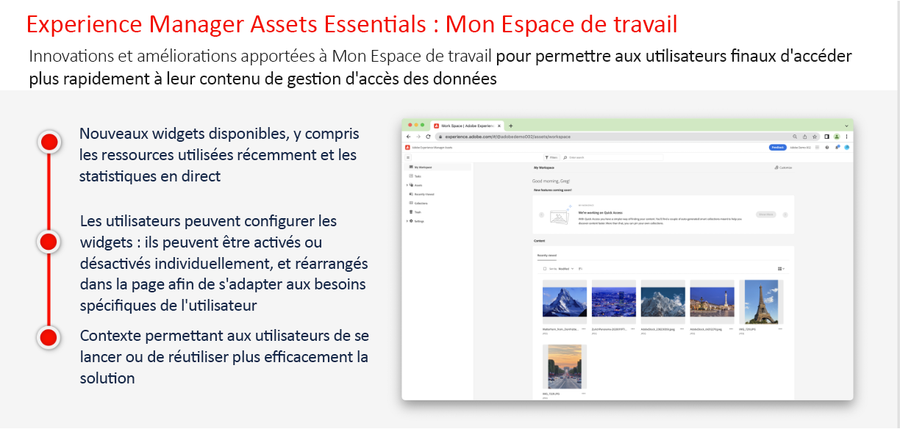
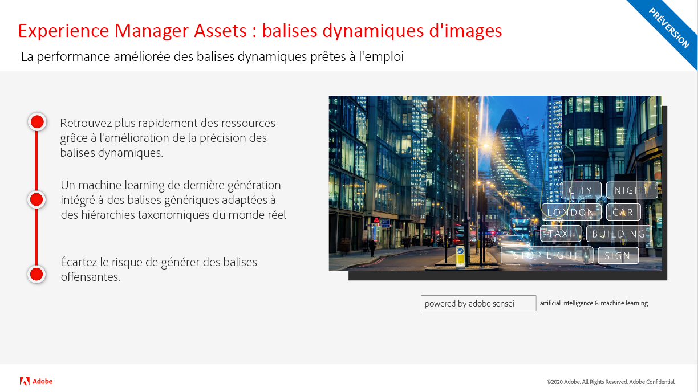
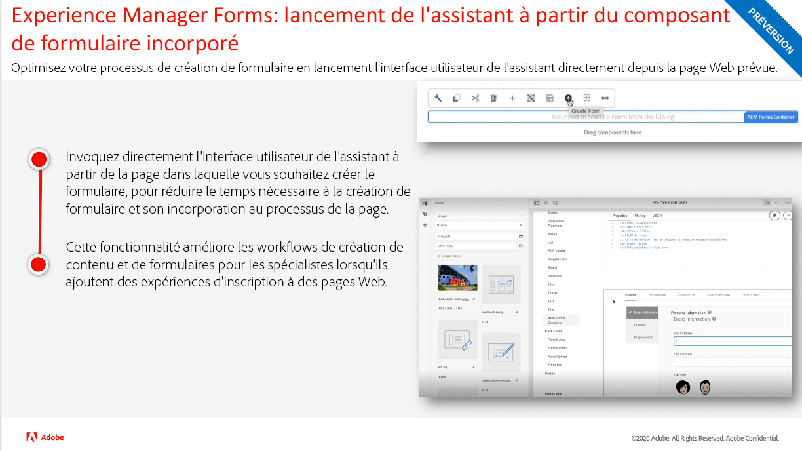
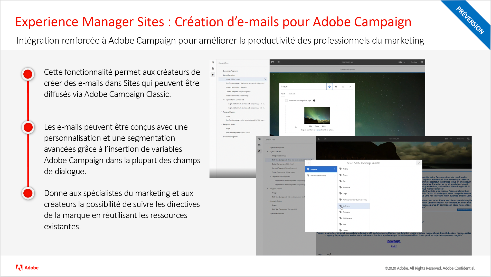
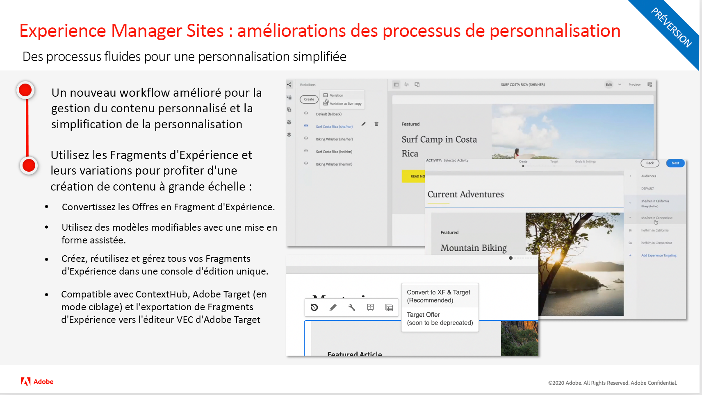
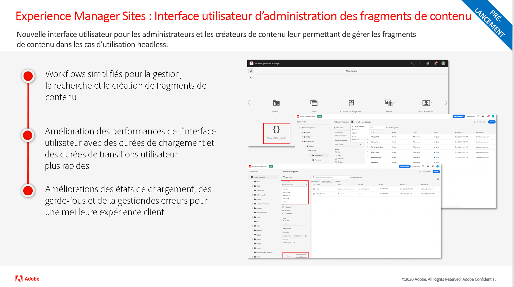
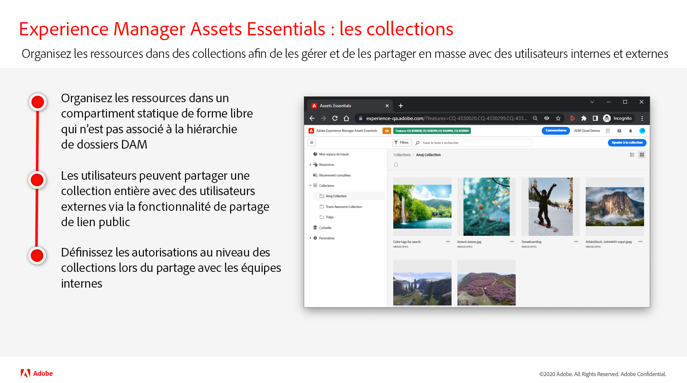
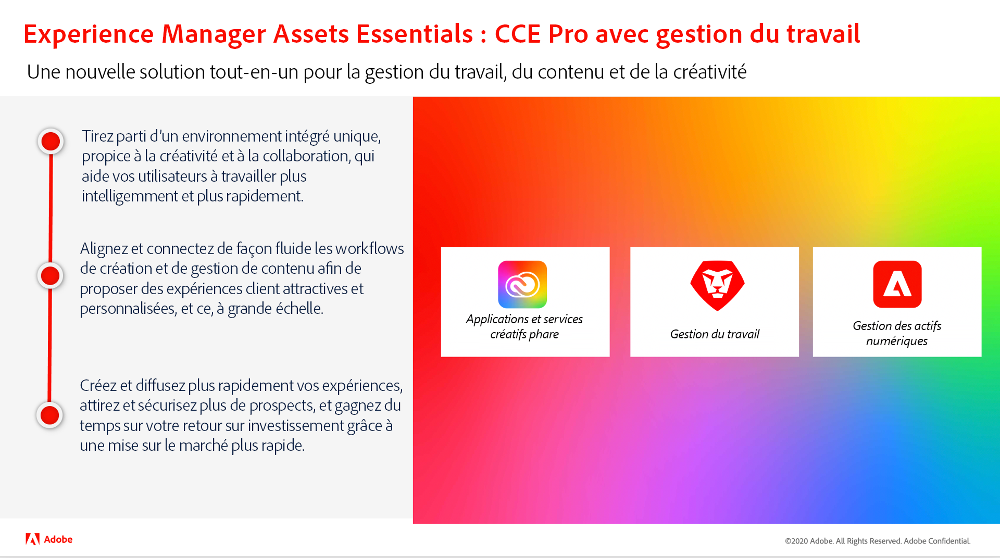
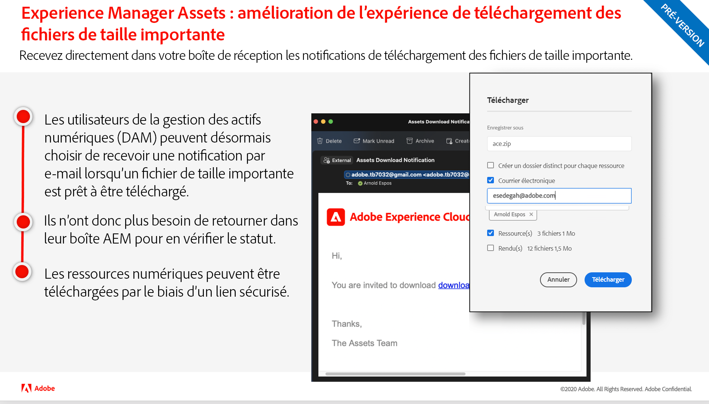

# Mises à jour de la version d’Adobe Experience Manager as a Cloud Service

Découvrez rapidement les dernières fonctionnalités d’Adobe Experience Manager as a Cloud Service. Ces courtes vidéos d’environ 10 minutes sont diffusées par l’équipe produit d’AEM pour partager les principales caractéristiques de la dernière mise à jour.

## Dernière mise à jour

<table style="max-width: 50%;">
  <tr>
    <td>
      
      

        <a href="./2023/2023-2-0.md">
          <strong>Version | 2023.2.0</strong>
           
          </a>
          <em>Date de publication : mars 2023 </em>
      

      

        <a href="https://experienceleague.adobe.com/docs/experience-manager-cloud-service/content/release-notes/release-notes/release-notes-current.html?lang=fr">Notes de mise à jour</a>
      

    </td>
  </tr>  
</table>

## Mises à jour précédentes

<table style="max-width: 50%;">
  <tr>
    <td>
      
      

        <a href="./2023/2023-1-0.md">
          <strong>Version | 2023.1.0</strong>
           
        </a>
          <em>Date de publication : fév. 2023 </em>
      

      

        <a href="https://experienceleague.adobe.com/docs/experience-manager-cloud-service/content/release-notes/release-notes/release-notes-current.html?lang=fr">Notes de mise à jour</a>
      

    </td>
    <td>
      
      

        <a href="./2022/2022-10-0.md">
          <strong>Version | 2022.10.0</strong>
           
        </a>
          <em>Date de publication : 13 octobre 2022</em>
      

      

        <a href="https://experienceleague.adobe.com/docs/experience-manager-cloud-service/content/release-notes/release-notes/release-notes-current.html?lang=fr">Notes de mise à jour</a>
      

    </td>  
    <td>
      
      

        <a href="./2022/2022-8-0.md">
          <strong>Version | 2022.8.0</strong>
           
        </a>
          <em>Date de publication : 1er septembre 2022 </em>
      

      

        <a href="https://experienceleague.adobe.com/docs/experience-manager-cloud-service/content/release-notes/release-notes/release-notes-current.html?lang=fr">Notes de mise à jour</a>
      

    </td>
  </tr>
  <tr> 
    <td>
      
      

        <a href="./2022/2022-7-0.md">
          <strong>Version | 2022.7.0</strong>
           
        </a>
          <em>Date de publication : 8 août 2022 </em>
      

      

        <a href="https://experienceleague.adobe.com/docs/experience-manager-cloud-service/content/release-notes/release-notes/release-notes-current.html?lang=fr">Notes de mise à jour</a>
      

    </td>
    <td>
      
      

        <a href="./2022/2022-6-0.md">
          <strong>Version | 2022.6.0</strong>
         
      </a>
        <em>Date de publication : 30 juin 2022 </em>
      

      

        <a href="https://experienceleague.adobe.com/docs/experience-manager-cloud-service/content/release-notes/release-notes/release-notes-current.html?lang=fr">Notes de mise à jour</a>
      

    </td>
    <td>
      
      

        <a href="./2022/2022-5-0.md">
          <strong>Version | 2022.5.0</strong>
         
      </a>
        <em>Date de publication : 9 juin 2022 </em>
      

      

        <a href="https://experienceleague.adobe.com/docs/experience-manager-cloud-service/content/release-notes/release-notes/release-notes-current.html?lang=fr">Notes de mise à jour</a>
      

    </td>
  </tr>
  <tr>     
    <td>
      
      

        <a href="./2022/2022-4-0.md">
          <strong>Version | 2022.4.0</strong>
         
      </a>
        <em>Publiée le 5 mai 2022 </em>
      

      

        <a href="https://experienceleague.adobe.com/docs/experience-manager-cloud-service/content/release-notes/release-notes/release-notes-current.html?lang=fr">Notes de mise à jour</a>
      

    </td>
    <td>
      
      

        <a href="./2022/2022-3-0.md">
          <strong>Version | 2022.3.0</strong>
         
      </a>
        <em>Publiée le 31 mars 2022 </em>
      

      

        <a href="https://experienceleague.adobe.com/docs/experience-manager-cloud-service/content/release-notes/release-notes/release-notes-current.html?lang=fr">Notes de mise à jour</a>
      

    </td>
    <td>
      
      

        <a href="./2022/2022-1-0.md">
          <strong>Version | 2022.1.0</strong>
         
      </a>
        <em>Publiée le 3 février 2022 </em>
      

      

        <a href="https://experienceleague.adobe.com/docs/experience-manager-cloud-service/content/release-notes/release-notes/2022/release-notes-2022-1-0.html?lang=fr">Notes de mise à jour</a>
      

    </td>
  </tr>
</table>